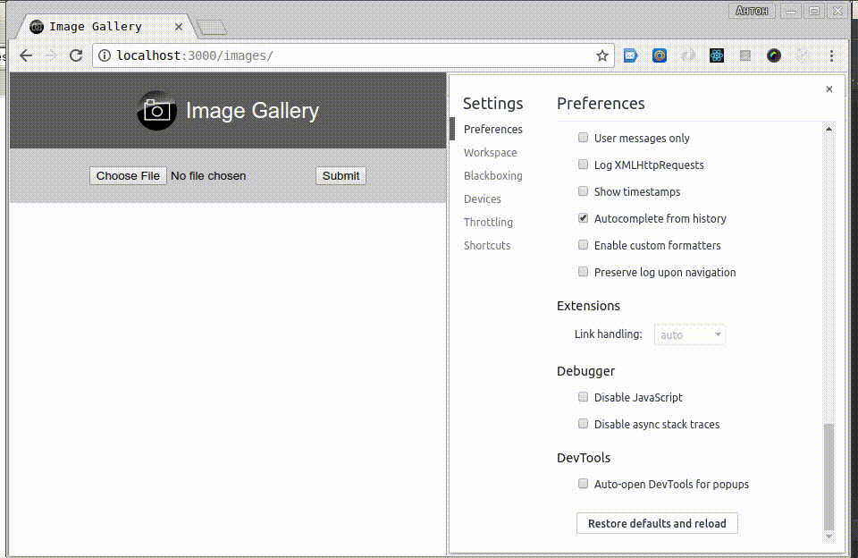

# image-gallery
A gallery for viewing images

Express + MongoDB + Mongoose + ES6, ES7 + Async/Await + Ajax/non-AJAX mode

1. Image Uploader: Upload ->  Extract Metadata -> Compress an image
2. Images are shown in multiple columns depending on the size of the display. They can be deleted. 
3. Images can be commented (create/update description)

### Usage
``` bash
git clone https://github.com/MrCheater/image-gallery.git
cd image-gallery
npm install
npm run start
```

### Live Demo
##### SPA + Ajax mode


##### Disable JavaScript + Non-ajax mode


### Requirements
* MongoDB 3.4.9
* Node.js 8.5.0
  
### License

This project is licensed under the terms of the MIT license